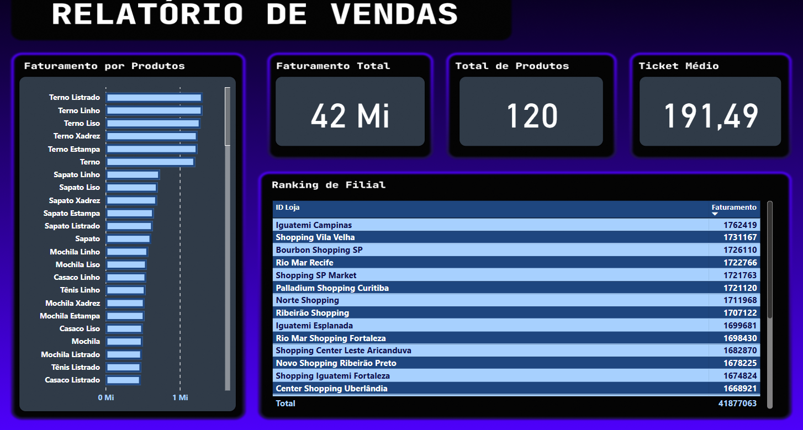

# Relatório de Vendas

##  Descrição
Este dashboard foi desenvolvido no **Power BI** para análise de vendas de uma rede varejista.  
O relatório apresenta métricas essenciais como faturamento total, ticket médio e ranking de filiais, permitindo uma visão clara do desempenho comercial.

##  Objetivo
Fornecer uma ferramenta interativa para acompanhamento das vendas, auxiliando na tomada de decisão estratégica sobre **produtos mais rentáveis** e **filiais de maior desempenho**.

##  Tecnologias e técnicas utilizadas
- **Power BI Desktop**
- **DAX** para medidas (cálculo de faturamento, ticket médio e total de produtos)
- Modelagem de dados a partir de planilha Excel (`vendas.xlsx`)
- Visualizações personalizadas para destacar KPIs

##  Principais indicadores
- **Faturamento Total:** R$ 42 Mi  
- **Total de Produtos:** 120  
- **Ticket Médio:** R$ 191,49  
- **Ranking de Filiais** com base no faturamento  

### Faturamento por Produtos
Exibe os produtos mais vendidos, destacando a linha de **ternos e sapatos** como líderes em receita.

### Ranking de Filiais
Classificação das principais lojas, como Iguatemi Campinas, Shopping Vila Velha e Bourbon Shopping SP, responsáveis pelo maior faturamento.

##  Exemplo do dashboard

##  Estrutura do projeto
- `data/` → base de dados (`vendas.xlsx`)  
- `reports/` → relatório em Power BI (`Dash-Desafio-1.pbix`)  
- `images/` → captura do dashboard (`preview.png`)  
- `README.md` → explicação detalhada do projeto  

---
